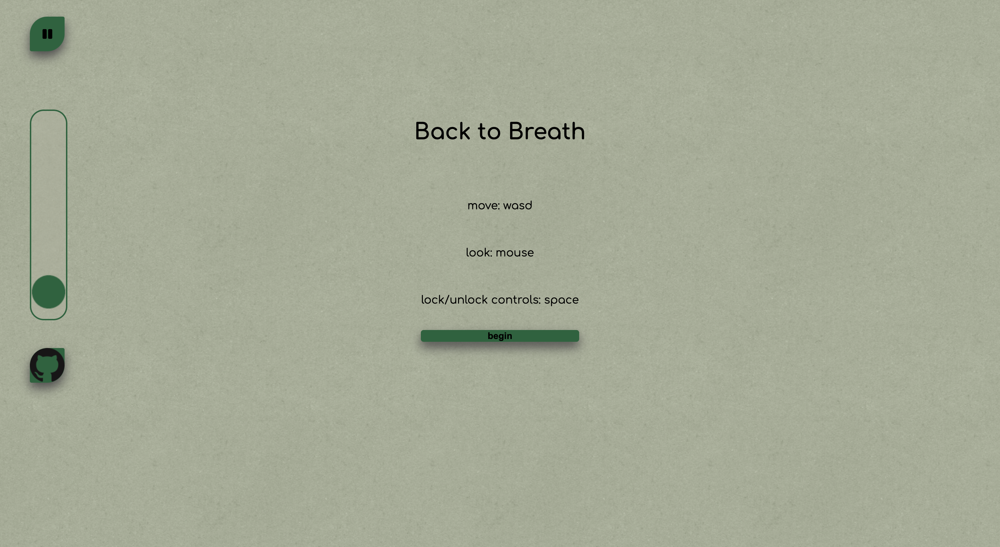
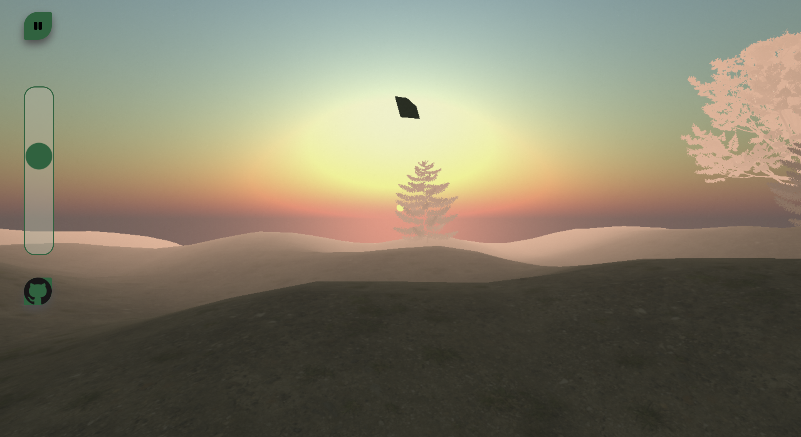

## [Try it Here](https://ashes4trees.github.io/back_to_breath/)

## Background

For those of us who spend a lot of time at our desks, finding brief moments of calm throughout the day are crucial. This project aims to provide a digital destressing space for users, with a scenic landscape including whimsical animations, meditative music, and visual prompts to help slow breathing. 

## Functionality & MVPs

* In Back to Breath, users can:
* Select their preferred music 
* Select a length of time for their “meditation”
* Match their breathing to a repetitive visual cue
* Navigate through a scenic 3D landscape using keys and mouse

In addition, the project includes:
* Links to my professional networking profiles
* A production READMe

## Images





## Pre-Production Wireframes


## Technologies, Libraries, APIs

This project was created with:

* Canvas API to render the image
* Three.js to responsively animate image elements
* Webpack to bundle script files 
* npm to manage dependencies

In order to be able to place 3D Models such as rocks and trees into the scene at random, I used a random generator. This approach only suffices for the x- and z-coordinates, given that the ground (y-axis) was also randomized. In order to avoid floating objects, I initiated a raycaster for each casting directly downward and set the y-coordinate to the point at which the ray intersected the ground. 

```javascript
  tree.position.set(randomPosX, 500, randomPosZ);
    const raycaster = new THREE.Raycaster();
    raycaster.set(tree.position, new THREE.Vector3(0, -1, 0))
    const intersects = raycaster.intersectObject(ground);
    tree.position.y = intersects[0].point.y - 0.2;
    scene.add(tree);
```

To render an animated leaf at the beginning of the scene, I created a simple model using Three.js circle geometry, then used a Three.js clock to get time change data. By passing this into the translateY function, the leaf moves directly upward while also rotating. 

```javascript
  this.leaf.translateY(leafClock.getDelta() * 10);
  this.leaf.rotateY(.25);
  requestAnimationFrame(this.animate.bind(this)); 
```

## Implementation Timeline

Friday Afternoon & Weekend:
Complete project setup. Create basic HTML layout and canvas. Get user prompts for music and time working. Dive into Three.js docs and make a plan to generate animations.
Monday:
Render static image background. Create classes and animation models for each moving element.
Tuesday
Get 1-2 animations working and debugged. 
Wednesday
Complete music controls and styling. Add 1 animation.
Thursday Morning
Deploy project to GitHub Pages.

## Bonus Features
Features that will be added:
* Additional animations
* Increased interaction with models (e.g. animations triggered by click event)
* A sunset/fadeout sequence at the end of a given meditation session
